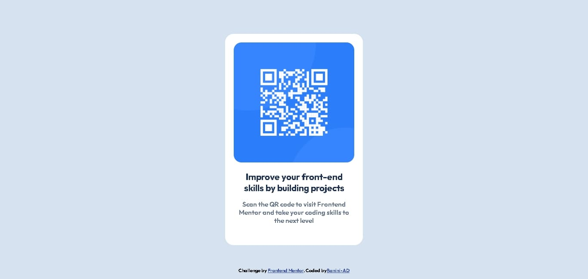

# Frontend Mentor - QR code component solution

This is a solution to the [QR code component challenge on Frontend Mentor](https://www.frontendmentor.io/challenges/qr-code-component-iux_sIO_H). Frontend Mentor challenges help you improve your coding skills by building realistic projects. 

## Table of contents

- [Overview](#overview)
  - [Screenshot](#screenshot)
  - [Links](#links)
- [My process](#my-process)
  - [Built with](#built-with)
  - [What I learned](#what-i-learned)
  - [Continued development](#continued-development)
  - [Useful resources](#useful-resources)
- [Author](#author)

### Screenshot

 

### Links

- Solution URL: [My Solution](https://github.com/Banini-AD/dev-in-the-making/tree/main)
- Live Site URL: [LIve Site](https://banini-ad.github.io/dev-in-the-making/)

## My process

### Built with

- Semantic HTML5 markup
- CSS custom properties
- Flexbox
- Mobile-first workflow

### What I learned

This project helped me understand the importance of Semantic HTML5 markup and reminded me of some additional HTML5 elements. It showed me how essential it is to use Semantic HTML5 markup when creating web content.

I learned that using these semantic elements can make websites more accessible for everyone, including people with disabilities. It also helps improve search engine optimization, making it easier for search engines to find and rank my content. Additionally, I discovered that organizing my code with semantic HTML5 makes it cleaner and easier to read, which is helpful for working with others and maintaining the site in the future.

Overall, this project greatly expanded my knowledge of web development best practices and taught me more about how different HTML elements work. It empowered me to create better and more user-friendly websites.

```html
Semantic HTML 5 elements
<heading></heading>
<nav></nav>
<section></section>
<section></section>
Learned Functionalities of the following element
<aside></aside>
<article></article>
and so on...
```

### Continued development

I would like to improve my code for better search engine optimization, so that search engines can find and rank my content effectively. This will help me create better and more user-friendly websites.

### Useful resources

- [Google](https://www.google.com) - This helped me for learning the Semantic HTML 5. I really liked it and will use it going forward.I'd recommend it to anyone still learning this concept.
- [Youtube](https://www.youtube.com) - This helped me get to know how the Semantic HTML 5 is used . I'd recommend it to anyone still learning this concept.

## Author
- Frontend Mentor - [@Banini-AD](https://www.frontendmentor.io/profile/Banini-AD)
